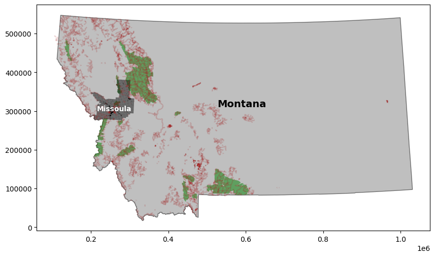
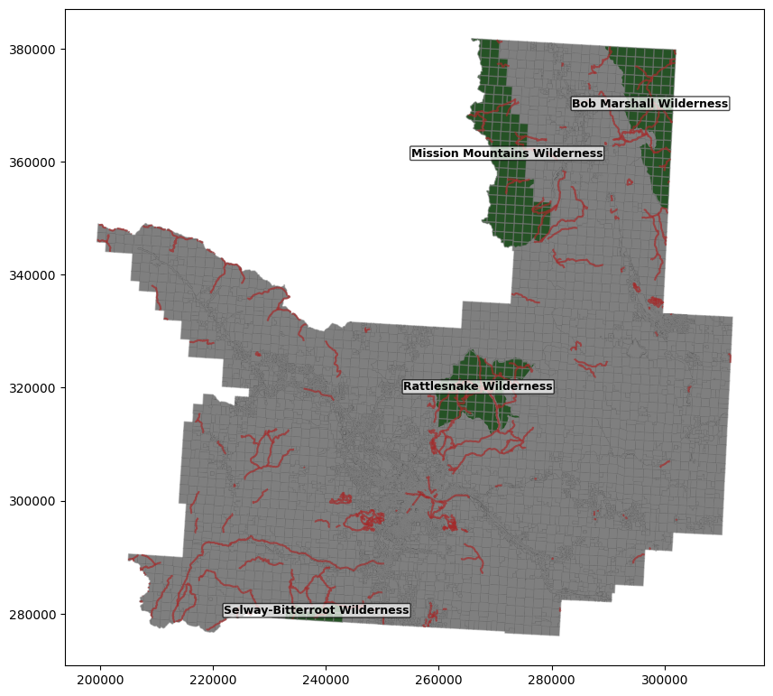

# Analyzing the Effect of Hiking Trails and National Wilderness Areas on Missoula County Montana Parcel Value

The goal of this project is to do a quick demo of how to work with Geopandas and use it to do simple spatial operations and analysis. The general workflow can be seen in the jupyter notebook in this repository. 

